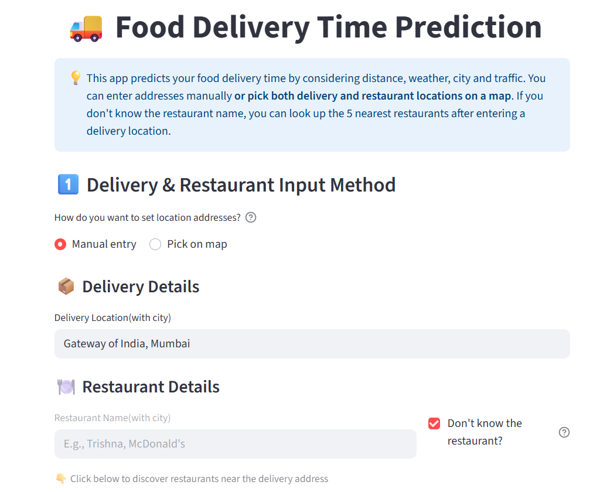
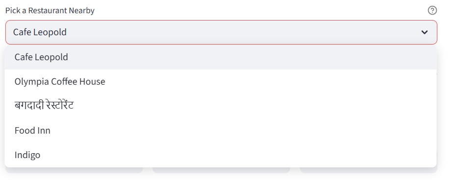
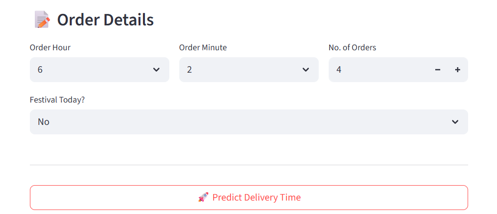
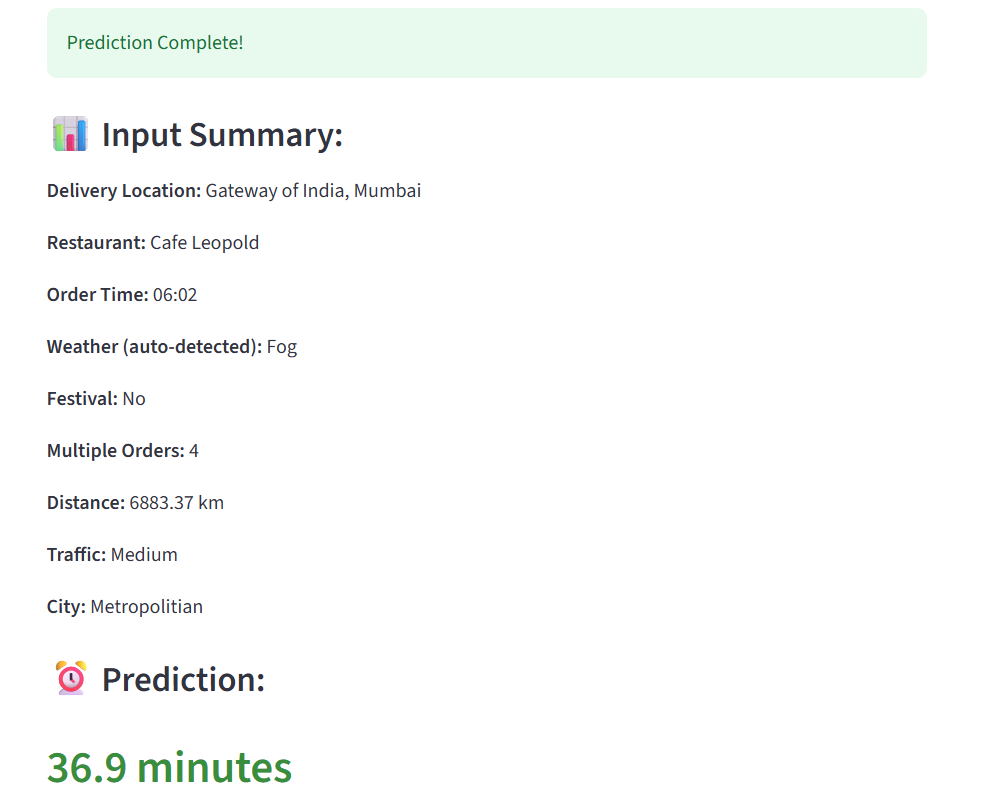

# 🚚 Food Delivery Time Prediction

An intelligent machine learning project that predicts food delivery time using geolocation, weather data, and user input — designed with simplicity, modularity, and real-world usability in mind.





---

## 📌 Project Highlights

- 🗺️ Location-based predictions using geocoding and weather APIs  
- ⏱️ **Linear Regression** to estimate **Pickup Time**  
- 🔁 Final ETA prediction using **XGBoost** and **LightGBM**  
- 📍 Map-based input for delivery and restaurant locations  
- ⚡ Real-time inference via **Streamlit** deployment  

---
## 🛠️ Tech Stack
- 🐍 Python

- 📊 Pandas, NumPy

- 🧠 scikit-learn, XGBoost, LightGBM

- 🌐 Streamlit (frontend & deployment)

- 📍OpenStreeMap,Geoapify

- ☁️ OpenWeatherMap API


## 🧠 Model Architecture

### Step 1: Predict Pickup Time  
A **Linear Regression** model is trained to predict the time a restaurant takes to hand over the food after an order.

### Step 2: Predict Final ETA  
That predicted pickup time is then used as input to a **blended model** (XGBoost + LGBM) to predict final delivery time.

```mermaid
flowchart LR
    A[User Input] --> B[Geocoding API]
    B --> C[Weather API]
    C --> D[Pickup Time - Linear Regression]
    D --> E[ETA Prediction - XGBoost + LGBM]
    E --> F[Predicted Delivery Time]

```bash
git clone https://github.com/your-username/food-delivery-time-prediction.git
cd food-delivery-time-prediction

